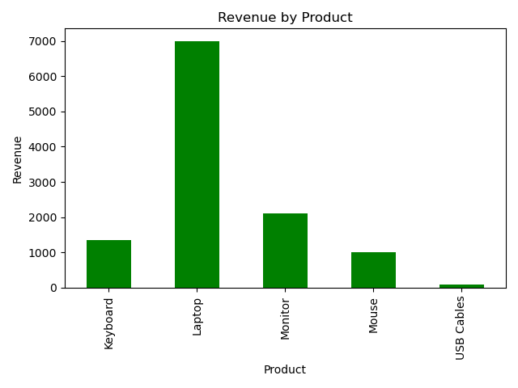
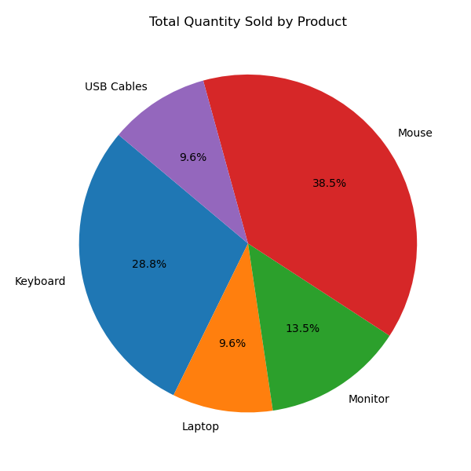

{
 "cells": [
  {
   "cell_type": "markdown",
   "id": "3046d31c-2167-4953-a280-811e155da551",
   "metadata": {},
   "source": [
    "# Task 7 - Sales Summary with Python and SQLite\n",
    "\n",
    "## Objective\n",
    "Analyze sales data stored in a SQLite database using SQL inside Python. Generate a summary of total quantity and revenue by product, and visualize the results using bar and pie charts.\n",
    "\n",
    "## Tools Used\n",
    "- Python\n",
    "- SQLite (`sqlite3`)\n",
    "- Pandas\n",
    "- Matplotlib\n",
    "- Jupyter Notebook\n",
    "\n",
    "## Steps Performed\n",
    "\n",
    "### 1. Created SQLite Database\n",
    "A new database `sales_data.db` was created containing a single table `sales` with sample product data including quantity and price.\n",
    "\n",
    "### 2. Ran SQL Query to Summarize Data\n",
    "Used a SQL query to calculate:\n",
    "- Total quantity sold (`SUM(quantity)`)\n",
    "- Total revenue (`SUM(quantity * price)`)\n",
    "Grouped by product.\n",
    "\n",
    "### 3. Loaded Data into pandas\n",
    "The SQL result was imported into a pandas DataFrame for analysis.\n",
    "\n",
    "### 4. Displayed Sales Summary\n",
    "Printed a clean summary showing quantity and revenue per product.\n",
    "\n",
    "### 5. Visualized Results\n",
    "Created the following charts using `matplotlib`:\n",
    "- **Bar Chart** of Revenue by Product\n",
    "- **Bar Chart** of Quantity Sold by Product\n",
    "\n",
    "### 6. Calculated Total Revenue\n",
    "Displayed total revenue across all products.\n",
    "\n",
    "### 7. Additional Insights\n",
    "- Identified the **top-selling product** (by quantity)\n",
    "- Identified the **highest revenue product**\n",
    "- Calculated **average revenue per unit** per product\n",
    "\n",
    "### 8. Exported to CSV\n",
    "Exported the summary DataFrame to `sales_summary.csv`.\n",
    "\n",
    "## Outputs\n",
    "- Jupyter Notebook: `Task7.ipynb`\n",
    "- Database file: `sales_data.db`\n",
    "- Charts: `sales_chart.png`, `quantity_chart.png`, `quantity_pie_chart.png`, `revenue_pie_chart.png`\n",
    "- CSV file: `sales_summary.csv`\n",
    "\n",
    "## Charts\n",
    "Screenshots included in the notebook:\n",
    "- \n",
    "- \n",
    "\n",
    "## Conclusion\n",
    "This project demonstrates the ability to:\n",
    "- Use SQL inside Python\n",
    "- Perform basic data aggregation\n",
    "- Visualize business data effectively\n",
    "- Extract real-world insights from sales data\n"
   ]
  },
  {
   "cell_type": "code",
   "execution_count": null,
   "id": "451098a3-bbc1-457e-ac0b-02503e1ccba8",
   "metadata": {},
   "outputs": [],
   "source": []
  }
 ],
 "metadata": {
  "kernelspec": {
   "display_name": "Python 3 (ipykernel)",
   "language": "python",
   "name": "python3"
  },
  "language_info": {
   "codemirror_mode": {
    "name": "ipython",
    "version": 3
   },
   "file_extension": ".py",
   "mimetype": "text/x-python",
   "name": "python",
   "nbconvert_exporter": "python",
   "pygments_lexer": "ipython3",
   "version": "3.11.7"
  }
 },
 "nbformat": 4,
 "nbformat_minor": 5
}
